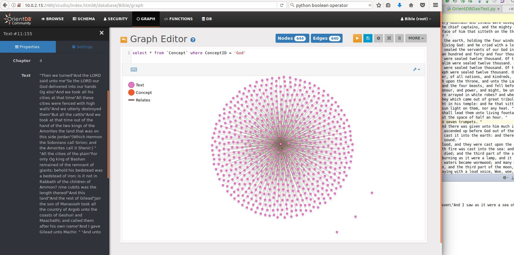

Description: This project aims to run machine learning analysis on the Bible and other famous texts.

e.g. Analyzing Bible text in OrientDB (Natural Language Processing to come!)

Use OrientDB as GraphDB. (worse documentation than Neo4j but should be cheaper in long run).

Install OrientDB:
https://www.digitalocean.com/community/tutorials/how-to-install-and-configure-orientdb-on-ubuntu-16-04

Start OrientDB: anthony@UbuntuDev:/opt/orientdb$ sudo bin/server.sh
CLI: sudo /opt/orientdb/bin/console.sh
GUI: http://your_server_ip:2480

Bible Dataset:
https://www.kaggle.com/phyred23/bibleverses

OrientDB Python client:
https://orientdb.com/docs/2.2/PyOrient.html